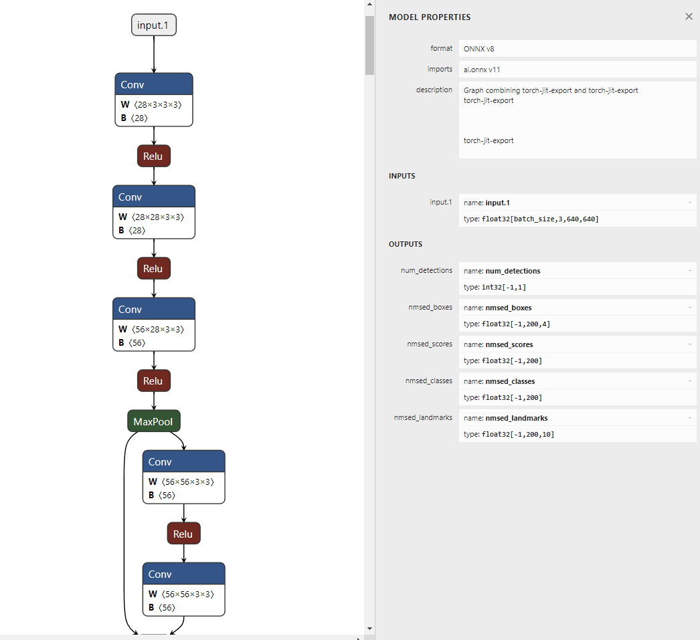

# AI-Engineer-Howto
## Convert model to TensorRT
### 1. Convert model to ONNX
Để thuận tiện cho việc deploy, các model sử dụng các framework khác nhau nên được convert sang ONNX, việc convert model từ ONNX sang các runtime khác cũng được dễ dàng hơn, đặc biệt là TensorRT
### 2. Get input/output shape
Sau khi convert model sang ONNX, ta cần xác định kích thước của input/output (cơ bản chỉ cần input) và các tham số tương ứng. Dễ dàng nhất là ta sử dụng [netron](https://netron.app/) để xem kiến trúc. Ví dụ trong hình dưới đây là model SCFD face detection được visualize sử dụng [netron](https://netron.app/):
<p align="center">
  
</p>

- Input:
    - **input.1** (float32): [batch_size, 3, 640, 640] hay [-1, 3, 640, 640] (những giá trị **khác số** được hiểu là giá trị dynamic (động))
- Output:
    - **num_detections** (int32): [-1, 1]
    - **nmsed_boxes** (float32): [-1, 200, 4]
    - **nmsed_scores** (float32): [-1, 200]
    - **nmsed_classes** (float32): [-1, 200]
    - **nmsed_landmarks** (float32): [-1, 200, 10]
### 3. Serialize Engine
Đầu tiên cần hiểu về **dynamic** và **static** đối với **shape** và **batch**
- **batch** (batch size): số lượng các input đầu vào, thường là dimension đầu tiên của tensor
- **shape**: kích thước các dimension của tensor, bao gồm cả **batch**
- **dynamic**: động
- **static**: cố định

Như vậy ta có:
- **dynamic batch**: chỉ **batch** dạng động, các shape khác giữ nguyên, chẳng hạn [-1, 3, 640, 640] thì ta có các input thỏa mãn là [1, 3, 640, 640], [7, 3, 640, 640], ... các input không thỏa mãn là [1, 3, 640, 512], [1, 4, 640, 640], ...
- **static shapes**: chỉ chấp nhận 1 kích thước cố định, chẳng hạn [4, 3, 640, 640] chỉ chấp nhận input [4, 3, 640, 640], còn [7, 4, 640, 512] chỉ chấp nhận input [7, 4, 640, 512], ...
- **dynamic shapes**: một số các dimension động, chẳng hạn [-1, 3, -1, 32] có thể chấp nhận các input [4, 3, 214, 32], [12, 3, 320, 32], ...
Thông thường ta chỉ quan tâm **dynamic shapes** và **static shapes**

Tiến hành convert (serialize), ta có 2 kiểu convert model chính là **implicitBatch** (mặc định) và **explicitBatch**. Giá trị batch_size được hiểu mặc định là giá trị đầu tiên, như trong model phía trên của mình đó là giá trị **-1**, nếu như trong trường hợp trên model của mình có kích thước input là **[1, 3, 640, 640]** thì model không hỗ trợ **dynamic shapes** mà chỉ hỗ trợ **static shapes**, tức là chấp nhận 1 kích thước đầu vào duy nhất. Tuy nhiên ta có một số phương pháp hỗ trợ convert model ONNX từ **dynamic** thành **static** và ngược lại.
- **implicitBatch** (default): Hoạt động với model có input dạng **static shapes**
- **explicitBatch**: Hoạt động với model có input dạng **dynamic shapes**

Ví dụ cho việc convert model sử dụng **implicitBatch** (kích thước input được xác định sẵn **static** trong meta ONNX model):

```
/usr/src/tensorrt/bin/trtexec \
        --implicitBatch \
        --onnx=<path-to-ONNX-model> \
        --saveEngine=output.plan \
        --device=0 \
        --verbose
```

Ví dụ cho việc convert model sử dụng **explicitBatch** (ở đây ta phải xác định thêm **minShapes**, **optShapes** và **maxShapes** của từng input):

```
/usr/src/tensorrt/bin/trtexec \
        --explicitBatch \
        --onnx=<path-to-ONNX-model> \
        --minShapes=input.1:1x3x640x640 \
        --optShapes=input.1:1x3x640x640 \
        --maxShapes=input.1:4x3x640x640 \
        --saveEngine=output.plan \
        --device=0 \
        --verbose 
```

trong đó: <br>
    - **saveEngine**: đường dẫn đến model TensorRT output, thường để đuôi **.plan** hoặc **.trt** <br>
    - **device**: GPU ID <br>
    - **verbose**: in ra log của quá trình convert <br>
    - Cú pháp định nghĩa các shape trong trường hợp có nhiều input: ```<input1-name>:<input1-shape>,<input2-name>:<input2-shape>,...```

### 3. Deserialize Engine & Inference
Sau khi có model tensorrt (hay còn gọi là engine file), ta cần thực hiện việc load model và inference
- Cài đặt pycuda & tensorrt python binding như trong hướng dẫn ở [đây](https://github.com/NNDam/Retinaface-TensorRT)
- Wrap model gồm 3 function chính: allocate_buffers, do_inference, post_process
- Tham khảo việc wrap model tại example repositories

#### 3.1. Allocate buffers
Khởi tạo bộ nhớ cho các inputs & outputs. Lưu ý rằng đối với **dynamic shapes** model ta cần allocate theo kích thước của inputs và outputs theo **maxShapes**

```
# Allocates all buffers required for an engine, i.e. host/device inputs/outputs.
def allocate_buffers(engine):
    inputs = []
    outputs = []
    bindings = []
    stream = cuda.Stream()
    out_shapes = []
    input_shapes = []
    out_names = []
    max_batch_size = engine.get_profile_shape(0, 0)[2][0]
    for binding in engine:
        binding_shape = engine.get_binding_shape(binding)
        # Fix -1 dimension for proper memory allocation for batch_size > 1
        if binding_shape[0] == -1: # Dynamic batch size
            binding_shape = (max_batch_size,) + binding_shape[1:]
        size = trt.volume(binding_shape)
        dtype = trt.nptype(engine.get_binding_dtype(binding))
        # Allocate host and device buffers
        host_mem = cuda.pagelocked_empty(size, dtype)
        device_mem = cuda.mem_alloc(host_mem.nbytes)
        # Append the device buffer to device bindings.
        bindings.append(int(device_mem))
        # Append to the appropriate list.
        if engine.binding_is_input(binding):
            inputs.append(HostDeviceMem(host_mem, device_mem))
            input_shapes.append(engine.get_binding_shape(binding))
        else:
            outputs.append(HostDeviceMem(host_mem, device_mem))
            #Collect original output shapes and names from engine
            out_shapes.append(engine.get_binding_shape(binding))
            out_names.append(binding)
    return inputs, outputs, bindings, stream, input_shapes, out_shapes, out_names, max_batch_size
```

#### 3.2. Inference
Tiến hành inference, bao gồm lấy dữ liệu inputs từ host sang device GPU, thực hiện execute trên device GPU để thu được outputs và copy outputs từ device GPU về host

```
def do_inference(context, bindings, inputs, outputs, stream):
    # Transfer input data to the GPU.
    [cuda.memcpy_htod_async(inp.device, inp.host, stream) for inp in inputs]
    # Run inference.
    context.execute_async_v2(bindings=bindings, stream_handle=stream.handle)
    # Transfer predictions back from the GPU.
    [cuda.memcpy_dtoh_async(out.host, out.device, stream) for out in outputs]
    # Synchronize the stream
    stream.synchronize()
    # Return only the host outputs.
    return [out.host for out in outputs]
```

#### 3.3. Post-processing 
Tiến hành reshape lại dữ liệu outputs tùy vào yêu cầu của bài toán và thực hiện các post-processing khác

## Example repositories
- [Simple VGG16 Image Classification](https://git.icomm.vn/ICTensortRT/VGG16)
- [Retinaface](https://github.com/NNDam/Retinaface-TensorRT)
- [vietocr](https://github.com/NNDam/vietocr-tensorrt) 
- [yolor](https://github.com/NNDam/yolor)