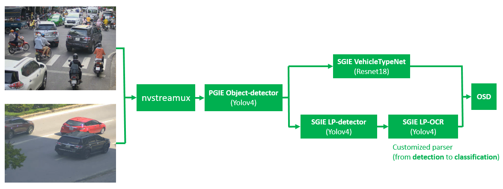
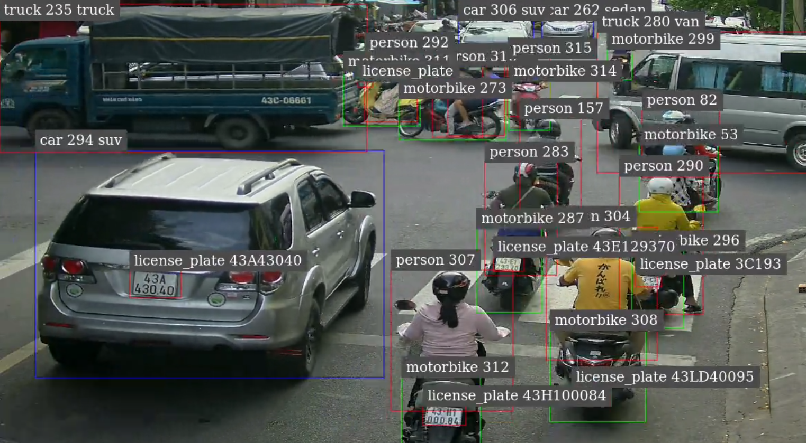
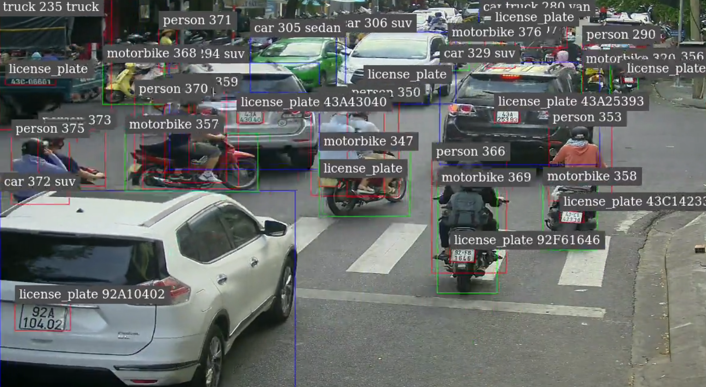

# Deepstream ALPR

<p align="center">
  
</p>

## 1. Requirement
- Deepstream 6.0

## 2. Run demo
```
cd nvdsinfer_custom_impl_Yolo
make
cd ..
deepstream-app -c config_deepstream.txt
```
<p align="center">
  
  
</p>

## 3. Models
### 3.1 Object detection
- Sử dụng phiên bản Darknet COCO yolov4-608x608 
- Convert sang ONNX
- [Bổ sung NMS Plugin](../sample-yolov4/tools/add_nms_plugins.py)
- Customized parser: **NvDsInferParseCustomYoloV4**

### 3.2 Vehicle Type Net
- Sử dụng model Resnet18 classification từ NVIDIA TAO
- Tiến hành training & prune & INT8 quantization

### 3.3 License Plate Detection
- Sử dụng model yolov4 từ NVIDIA TAO
- Tiến hành training & prune & INT8 quantization
- Customized parser: **NvDsInferParseCustomYoloV4TLT**

### 3.4 License Plate Recognition
- Sử dụng model yolov4 từ NVIDIA TAO
- Tiến hành training & prune & INT8 quantization
- Customized parser: **NvDsInferParseCustomYoloV4LPR** (sort các ký tự detect được và gán vào **attributeLabel**)

## References
- https://github.com/NVIDIA-AI-IOT/deepstream_lpr_app