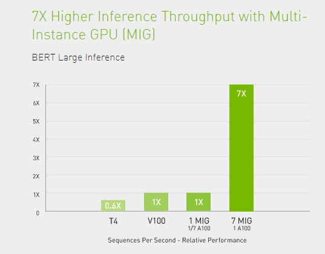

# Multi-instance GPU (MIG)

### 1. Tản mạn về cơ chế **Multi-instance GPU (MIG)** của NVIDIA

Các GPU dòng A (Ampere) của NVIDIA nổi tiếng là dòng cao cấp nhất, với số lõi TensorCore nhiều nhất và tốc độ xử lý gần như là nhanh nhất. Hiện tại mình đang sử dụng phiên bản **A100-PCIE-40Gb** là phiên bản GPU xịn nhất hiện tại của NVIDIA. Khác với dòng chuyên dành cho deploy như T4 với 16Gb VRAM hay V100 32Gb VRAM, A100 sử dụng đến 40Gb bộ nhớ và gần như là các tác vụ bình thường khó có thể khai thác tối đa hiệu năng của em nó, bao gồm cả GPU VRAM và Utilization (hay còn gọi là %GPU sử dụng trong ```nvidia-smi```). Vậy câu hỏi đặt ra là tại sao ta phải bỏ ra một khoản đầu tư lớn (so với V100) để tậu A100 ? Câu trả lời ít nhất mình tìm được nằm ở cơ chế **Multi-instance GPU**, hay còn gọi là **MIG**. Hiện tại **MIG** chỉ hỗ trợ GPU dòng A là A100 và A30.

<p align="center">
  
</p>

**MIG** được hiểu đơn giản là chia nhỏ GPU lớn thành các **instance** nhỏ hơn, với resources độc lập và không ảnh hưởng lẫn nhau, có thể nói là gần như thành các GPU con. Tuy nhiên hiện tại nó chưa thể nào đầy đủ tính năng như việc sử dụng nhiều GPU con (ví dụ như việc Triton support multi-GPU nhưng không support multi-MIG-GPU, ta phải deploy mỗi MIG một triton-inference-server và kết hợp với Kubernetes). Thế nhưng tùy mục đích sử dụng ta có thể tắt bật chế độ này. Chẳng hạn trong trường hợp nhiều tác vụ training model **nhỏ, nhẹ**, ta có thể sử dụng **MIG** training song song, và khi cần tác vụ training model **nặng**, ta lại vẫn có thể tắt **MIG** và sử dụng tiếp bình thường.

Trước tiên, để làm quen với MIG, ta cần hiểu 2 định nghĩa sau:
- **GPU-instance** là cấp độ phân vùng đầu tiên trên GPU. Nó khởi tạo một <i>wrapper</i> xung quanh:
  + **một** tập lát cắt vùng nhớ cố định (```memory-slices```)
  + **một** tập lát cắt tính toán cố định (```compute-slices```)
  + **một** tập các công cụ khác của GPU (ví dụ như JPEG encoders, DMA engine, ...)</br>
đại loại là tạo thành 1 phiên bản GPU thu nhỏ.
- **Compute-instance** là cấp độ thứ 2 của **MIG**, mỗi **GPU-instance** có thể bao gồm nhiều **compute-instance**. Nó tiến hành lấy **một tập con** của lát cắt tính toán của **GPU-instance** và nhóm chúng lại với nhau. Mỗi **compute-instance** chỉ có quyền truy cập vào tập con lớp lát cắt tính toán mà nó đã nhóm, nhưng có khả năng chia sẻ với các **compute-instance** khác lát cắt bộ nhớ và công cụ khác, đương nhiên là phải cùng một **GPU-instance**.

<p align="center">
  
</p>

### 2. Setup (root-permissions)
Mình sẽ thực hiện trên GPU 2.
- Đầu tiên, ta cần đảm bảo GPU đang không được sử dụng
```
server@rnd3:~$ sudo fuser -v /dev/nvidia2
                     USER        PID ACCESS COMMAND
/dev/nvidia2:        root      37270 F...m uvicorn
                     damnguyen  37904 F.... python3
                     damnguyen  37905 F.... python3
```
Như vậy, ta sẽ tiến hành tắt 3 processes với ID là 37270, 37904 và 37905. Tắt xong cần đảm bảo không có tác vụ nào đang sử dụng GPU đó.
- Bật **persistence-mode** cho GPU 2
```
server@rnd3:~$ sudo nvidia-smi -i 2 -pm 1
Enabled persistence mode for GPU 00000000:61:00.0.
All done.
```
- Bật **MIG** cho GPU 2
```
server@rnd3:~$ sudo nvidia-smi -i 2 -mig 1
Enabled MIG Mode for GPU 00000000:61:00.0
All done.
```
- Reset lại GPU 2
```
server@rnd3:~$ sudo nvidia-smi -i 2 --gpu-reset
GPU 00000000:61:00.0 was successfully reset.
All done.
```
- Tiếp theo, ta list tất cả các instance profiles mà phần cứng hỗ trợ
```
server@rnd3:~$ sudo nvidia-smi mig -lgip
+--------------------------------------------------------------------------+
| GPU instance profiles:                                                   |
| GPU   Name          ID    Instances   Memory     P2P    SM    DEC   ENC  |
|                           Free/Total   GiB              CE    JPEG  OFA  |
|==========================================================================|
|   2  MIG 1g.5gb     19     7/7        4.75       No     14     0     0   |
|                                                          1     0     0   |
+--------------------------------------------------------------------------+
|   2  MIG 2g.10gb    14     3/3        9.75       No     28     1     0   |
|                                                          2     0     0   |
+--------------------------------------------------------------------------+
|   2  MIG 3g.20gb     9     2/2        19.62      No     42     2     0   |
|                                                          3     0     0   |
+--------------------------------------------------------------------------+
|   2  MIG 4g.20gb     5     1/1        19.62      No     56     2     0   |
|                                                          4     0     0   |
+--------------------------------------------------------------------------+
|   2  MIG 7g.40gb     0     1/1        39.50      No     98     5     0   |
|                                                          7     1     1   |
+--------------------------------------------------------------------------+
```
- Ở đây, mình sẽ tiến hành chia con GPU 2 thành 2 con nhỏ 20Gb
```
server@rnd3:~$ sudo nvidia-smi mig -cgi 9,3g.20gb -C
Successfully created GPU instance ID  2 on GPU  2 using profile MIG 3g.20gb (ID  9)
Successfully created compute instance ID  0 on GPU  2 GPU instance ID  2 using profile MIG 3g.20gb (ID  2)
Successfully created GPU instance ID  1 on GPU  2 using profile MIG 3g.20gb (ID  9)
Successfully created compute instance ID  0 on GPU  2 GPU instance ID  1 using profile MIG 3g.20gb (ID  2)
```
Kết quả
```
server@rnd3:~$ sudo nvidia-smi mig -lgi
+----------------------------------------------------+
| GPU instances:                                     |
| GPU   Name          Profile  Instance   Placement  |
|                       ID       ID       Start:Size |
|====================================================|
|   2  MIG 3g.20gb       9        1          0:4     |
+----------------------------------------------------+
|   2  MIG 3g.20gb       9        2          4:4     |
+----------------------------------------------------+
```
- Verify trên các user
```
damnguyen@rnd3:~$ nvidia-smi
Thu Dec 30 14:19:30 2021
+-----------------------------------------------------------------------------+
| NVIDIA-SMI 460.91.03    Driver Version: 460.91.03    CUDA Version: 11.2     |
|-------------------------------+----------------------+----------------------+
| GPU  Name        Persistence-M| Bus-Id        Disp.A | Volatile Uncorr. ECC |
| Fan  Temp  Perf  Pwr:Usage/Cap|         Memory-Usage | GPU-Util  Compute M. |
|                               |                      |               MIG M. |
|===============================+======================+======================|
|   0  A100-PCIE-40GB      Off  | 00000000:01:00.0 Off |                    0 |
| N/A   51C    P0    45W / 250W |      0MiB / 40536MiB |      0%      Default |
|                               |                      |             Disabled |
+-------------------------------+----------------------+----------------------+
|   1  A100-PCIE-40GB      Off  | 00000000:25:00.0 Off |                    0 |
| N/A   40C    P0    37W / 250W |   6318MiB / 40536MiB |      0%      Default |
|                               |                      |             Disabled |
+-------------------------------+----------------------+----------------------+
|   2  A100-PCIE-40GB      On   | 00000000:61:00.0 Off |                   On |
| N/A   37C    P0    34W / 250W |     11MiB / 40536MiB |     N/A      Default |
|                               |                      |              Enabled |
+-------------------------------+----------------------+----------------------+
|   3  A100-PCIE-40GB      Off  | 00000000:A1:00.0 Off |                    0 |
| N/A   45C    P0    39W / 250W |      0MiB / 40536MiB |      0%      Default |
|                               |                      |             Disabled |
+-------------------------------+----------------------+----------------------+
|   4  A100-PCIE-40GB      Off  | 00000000:C1:00.0 Off |                    0 |
| N/A   46C    P0    43W / 250W |      0MiB / 40536MiB |      0%      Default |
|                               |                      |             Disabled |
+-------------------------------+----------------------+----------------------+
|   5  A100-PCIE-40GB      Off  | 00000000:E1:00.0 Off |                    0 |
| N/A   47C    P0    44W / 250W |      0MiB / 40536MiB |     13%      Default |
|                               |                      |             Disabled |
+-------------------------------+----------------------+----------------------+

+-----------------------------------------------------------------------------+
| MIG devices:                                                                |
+------------------+----------------------+-----------+-----------------------+
| GPU  GI  CI  MIG |         Memory-Usage |        Vol|         Shared        |
|      ID  ID  Dev |           BAR1-Usage | SM     Unc| CE  ENC  DEC  OFA  JPG|
|                  |                      |        ECC|                       |
|==================+======================+===========+=======================|
|  2    1   0   0  |      5MiB / 20096MiB | 42      0 |  3   0    2    0    0 |
|                  |      0MiB / 32767MiB |           |                       |
+------------------+----------------------+-----------+-----------------------+
|  2    2   0   1  |      5MiB / 20096MiB | 42      0 |  3   0    2    0    0 |
|                  |      0MiB / 32767MiB |           |                       |
+------------------+----------------------+-----------+-----------------------+

```

<i>Lưu ý: mặc định **GPU-instance** tự khởi tạo 1 **compute-instance**</i>

### 3. Tắt MIG (root-permissions)
Để tắt MIG, ta thực hiện như sau
- Xóa bỏ các cấu hình **compute-instance**
```
server@rnd3:~$ sudo nvidia-smi mig -dci -i 2
Successfully destroyed compute instance ID  0 from GPU  2 GPU instance ID  1
Successfully destroyed compute instance ID  0 from GPU  2 GPU instance ID  2
```
- Xóa bỏ các cầu hình **GPU-instance**
```
server@rnd3:~$ sudo nvidia-smi mig -dgi -i 2
Successfully destroyed GPU instance ID  1 from GPU  2
Successfully destroyed GPU instance ID  2 from GPU  2
```
- Tắt chế độ MIG trên GPU 2
```
server@rnd3:~$ sudo nvidia-smi -i 2 -mig 0
Disabled MIG Mode for GPU 00000000:61:00.0
All done.
```
- Khởi động lại GPU 2
```
server@rnd3:~$ sudo nvidia-smi -i 2 --gpu-reset
GPU 00000000:61:00.0 was successfully reset.
All done.
```
- Kết quả
```
damnguyen@rnd3:~$ nvidia-smi
Thu Dec 30 14:29:33 2021
+-----------------------------------------------------------------------------+
| NVIDIA-SMI 460.91.03    Driver Version: 460.91.03    CUDA Version: 11.2     |
|-------------------------------+----------------------+----------------------+
| GPU  Name        Persistence-M| Bus-Id        Disp.A | Volatile Uncorr. ECC |
| Fan  Temp  Perf  Pwr:Usage/Cap|         Memory-Usage | GPU-Util  Compute M. |
|                               |                      |               MIG M. |
|===============================+======================+======================|
|   0  A100-PCIE-40GB      Off  | 00000000:01:00.0 Off |                    0 |
| N/A   49C    P0    44W / 250W |      0MiB / 40536MiB |      0%      Default |
|                               |                      |             Disabled |
+-------------------------------+----------------------+----------------------+
|   1  A100-PCIE-40GB      Off  | 00000000:25:00.0 Off |                    0 |
| N/A   40C    P0    37W / 250W |   6318MiB / 40536MiB |      0%      Default |
|                               |                      |             Disabled |
+-------------------------------+----------------------+----------------------+
|   2  A100-PCIE-40GB      On   | 00000000:61:00.0 Off |                    0 |
| N/A   39C    P0    34W / 250W |      0MiB / 40536MiB |      0%      Default |
|                               |                      |             Disabled |
+-------------------------------+----------------------+----------------------+
|   3  A100-PCIE-40GB      Off  | 00000000:A1:00.0 Off |                    0 |
| N/A   43C    P0    38W / 250W |      0MiB / 40536MiB |      0%      Default |
|                               |                      |             Disabled |
+-------------------------------+----------------------+----------------------+
|   4  A100-PCIE-40GB      Off  | 00000000:C1:00.0 Off |                    0 |
| N/A   45C    P0    42W / 250W |      0MiB / 40536MiB |      0%      Default |
|                               |                      |             Disabled |
+-------------------------------+----------------------+----------------------+
|   5  A100-PCIE-40GB      Off  | 00000000:E1:00.0 Off |                    0 |
| N/A   45C    P0    43W / 250W |      0MiB / 40536MiB |     24%      Default |
|                               |                      |             Disabled |
+-------------------------------+----------------------+----------------------+
```
### 4. Using MIG-devices
Phần này sẽ đề cập đến cách sử dụng MIG, hay việc đơn giản nhất ta cần làm là **làm thế nào để lựa chọn GPU-instance**. Lưu ý rằng mình đã cấu hình khác với hướng dẫn ở trên. Ở trên mình hướng dẫn cho GPU 2 nhưng hiện tại mình đã setup MIG cho 2 thiết bị là GPU 4 và 5. Công việc rất đơn giản như sau:
- List tất cả các **MIG-devices** đang tồn tại
```
damnguyen@rnd3:~$ nvidia-smi -L
GPU 0: A100-PCIE-40GB (UUID: GPU-66ad7319-313a-6b24-503f-863dffa1e8cf)
GPU 1: A100-PCIE-40GB (UUID: GPU-11107e51-6363-81fc-8a73-0fd446a734f5)
GPU 2: A100-PCIE-40GB (UUID: GPU-9ef1da52-8dfb-5327-6a00-17097ba591a9)
GPU 3: A100-PCIE-40GB (UUID: GPU-aed1178e-1c4b-6b7f-00fb-5bb68359e862)
GPU 4: A100-PCIE-40GB (UUID: GPU-fb8bbc70-d551-45f9-43d4-9734f9cddb2c)
  MIG 3g.20gb Device 0: (UUID: MIG-GPU-fb8bbc70-d551-45f9-43d4-9734f9cddb2c/1/0)
  MIG 3g.20gb Device 1: (UUID: MIG-GPU-fb8bbc70-d551-45f9-43d4-9734f9cddb2c/2/0)
GPU 5: A100-PCIE-40GB (UUID: GPU-82864c44-d125-bf84-645f-e800925bf730)
  MIG 3g.20gb Device 0: (UUID: MIG-GPU-82864c44-d125-bf84-645f-e800925bf730/1/0)
  MIG 3g.20gb Device 1: (UUID: MIG-GPU-82864c44-d125-bf84-645f-e800925bf730/2/0)
```
- Trong ví dụ trên, mình chia 2 con GPU 4, 5 thành 4 MIG-devices. Lấy ví dụ mình lấy MIG-device 0 của GPU 5. Thực hiện chạy code đơn giản bằng lệnh
```
CUDA_VISIBLE_DEVICES=MIG-GPU-82864c44-d125-bf84-645f-e800925bf730/1/0 python app.py
```
- Hoặc chạy sử dụng multi GPU-instance
```
CUDA_VISIBLE_DEVICES=MIG-GPU-82864c44-d125-bf84-645f-e800925bf730/1/0,MIG-GPU-fb8bbc70-d551-45f9-43d4-9734f9cddb2c/1/0 python app.py
```
### 5. MIG-devices with Triton-inference-server
Hiện tại triton **không support việc load multiple MIG-devices**. Ở đây mình sẽ benchmark model load bằng nguyên 1 con GPU và load bằng GPU-instances 3g.20gb (một nửa GPU gốc). Kết quả cho thấy throughput giảm đi một nửa, đúng như nguyên lý của MIG

```
# Full A100-PCIE-40Gb
Concurrency: 1, throughput: 38.8 infer/sec, latency 26482 usec
Concurrency: 2, throughput: 41.8 infer/sec, latency 48132 usec
Concurrency: 3, throughput: 41.8 infer/sec, latency 72420 usec

# MIG 3g.20gb
Concurrency: 1, throughput: 19.6 infer/sec, latency 51688 usec
Concurrency: 2, throughput: 20.4 infer/sec, latency 98995 usec
Concurrency: 3, throughput: 20.2 infer/sec, latency 148630 usec
```