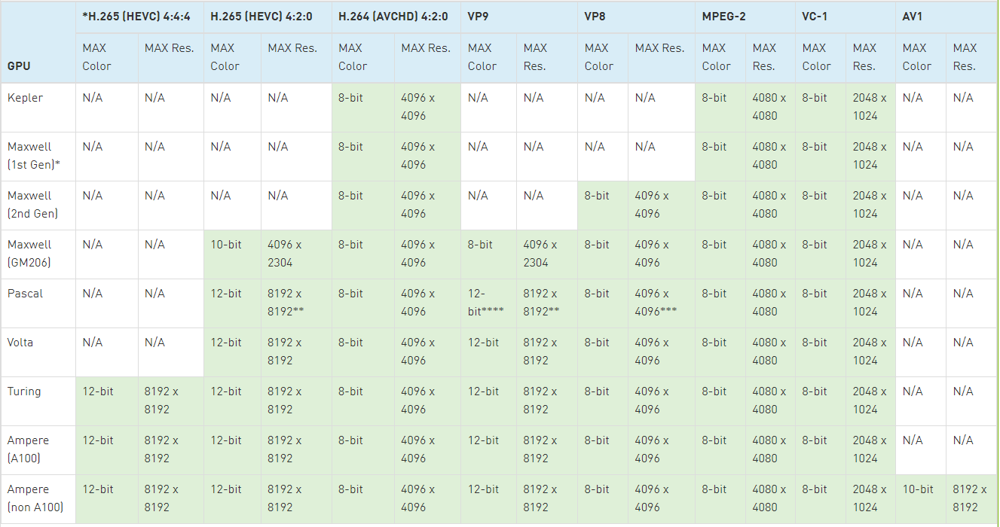

# FFMPEG hardware acceleration with Nvidia Video SDK
## 1. Requirements
- GPU with hardware-acceleration support, check here: https://developer.nvidia.com/video-encode-and-decode-gpu-support-matrix-new
- 
<p align="center">
  
  <i>Example of NVDEC support</i>
</p>

- Nvidia Driver
- CUDA Toolkit

## 2. Install FFMPEG with hardware acceleration
System Information
- OS: Ubuntu 18.04
- CPU: Intel(R) Xeon(R) X5650 (12M Cache, 2.66 GHz, 6.40 GT/S Intel® QPI)
- NVIDIA GTX 1060 OC 3Gb

```
sudo apt-get install build-essential yasm cmake libtool libc6 libc6-dev unzip wget libnuma1 libnuma-dev libx264-dev libvpx-dev libvorbis-dev

git clone  --branch sdk/11.1  https://git.videolan.org/git/ffmpeg/nv-codec-headers.git

cd nv-codec-headers && sudo make install && cd ..

git clone --branch n4.4.3 https://git.ffmpeg.org/ffmpeg.git ffmpeg/ && cd ffmpeg

./configure --enable-nonfree --enable-cuda-nvcc --enable-nvenc --enable-cuvid --enable-nvdec --enable-libnpp --extra-cflags=-I/usr/local/cuda/include --extra-ldflags=-L/usr/local/cuda/lib64 --disable-static --enable-shared --enable-libx264 --enable-libvpx --enable-libvorbis --enable-gpl --enable-cuda

make -j8

sudo make install

sudo ldconfig

```
If you meet 
- Check FFMPEG
```
ffmpeg --help
```
If you meet error about **nvcc**, try to change line 4355 of ```ffmpeg/configure``` to ```nvccflags_default="-gencode arch=compute_35,code=sm_35 -O2"```

## 3. Benchmark
### 3.1. Convert MPEG-4 to H264
- Public **libx264**
```
ffmpeg -y -i test.avi -c:v libx264 test.mp4

Output #0, mp4, to 'test.mp4':
  Metadata:
    major_brand     : mp42
    minor_version   : 0
    compatible_brands: isommp42
    com.android.model: 21121210C
    com.android.version: 12
    com.android.manufacturer: Xiaomi
    encoder         : Lavf58.76.100
  Stream #0:0(eng): Video: h264 (avc1 / 0x31637661), yuv420p(tv, bt709, progressive), 1920x1080, q=2-31, 30 fps, 15360 tbn (default)
    Metadata:
      creation_time   : 2022-11-23T08:27:41.000000Z
      handler_name    : VideoHandle
      vendor_id       : [0][0][0][0]
      encoder         : Lavc58.134.100 libx264
    Side data:
      cpb: bitrate max/min/avg: 0/0/0 buffer size: 0 vbv_delay: N/A
  Stream #0:1(eng): Audio: aac (LC) (mp4a / 0x6134706D), 48000 Hz, stereo, fltp, 128 kb/s (default)
    Metadata:
      creation_time   : 2022-11-23T08:27:41.000000Z
      handler_name    : SoundHandle
      vendor_id       : [0][0][0][0]
      encoder         : Lavc58.134.100 aac
frame= 4871 fps= 44 q=-1.0 Lsize=  263346kB time=00:02:42.27 bitrate=13294.1kbits/s dup=0 drop=3 speed=1.48x
video:260623kB audio:2550kB subtitle:0kB other streams:0kB global headers:0kB muxing overhead: 0.065733%
```
- Hardware acceleration
```
ffmpeg -y -i test.avi -c:v h264_nvenc test.mp4

Output #0, mp4, to 'test2.mp4':
  Metadata:
    major_brand     : mp42
    minor_version   : 0
    compatible_brands: isommp42
    com.android.model: 21121210C
    com.android.version: 12
    com.android.manufacturer: Xiaomi
    encoder         : Lavf58.76.100
  Stream #0:0(eng): Video: h264 (Main) (avc1 / 0x31637661), yuv420p(tv, bt709, progressive), 1920x1080, q=2-31, 2000 kb/s, 30 fps, 15360 tbn (default)
    Metadata:
      creation_time   : 2022-11-23T08:27:41.000000Z
      handler_name    : VideoHandle
      vendor_id       : [0][0][0][0]
      encoder         : Lavc58.134.100 h264_nvenc
    Side data:
      cpb: bitrate max/min/avg: 0/0/2000000 buffer size: 4000000 vbv_delay: N/A
  Stream #0:1(eng): Audio: aac (LC) (mp4a / 0x6134706D), 48000 Hz, stereo, fltp, 128 kb/s (default)
    Metadata:
      creation_time   : 2022-11-23T08:27:41.000000Z
      handler_name    : SoundHandle
      vendor_id       : [0][0][0][0]
      encoder         : Lavc58.134.100 aac
frame= 4871 fps=269 q=41.0 Lsize=   44291kB time=00:02:42.27 bitrate=2235.9kbits/s dup=0 drop=3 speed=8.95x
video:41583kB audio:2550kB subtitle:0kB other streams:0kB global headers:0kB muxing overhead: 0.356228%
[aac @ 0x5590e2d37e00] Qavg: 182.528
```
So basically, without care about bitrate, we can increase performance from **1.48x** to **8.95x** with NVIDIA hardware-acceleration
