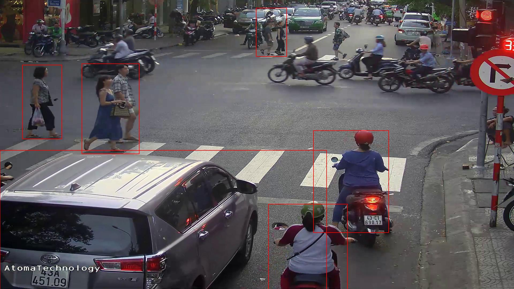

# TLT with DetectNet_V2

Phần này mình sẽ đề cập đến việc train-prune-quantization-export model DetectNet_V2 trên TLT
<p align="center">
  
</p>

## 1. Dataset

Mình sẽ lấy ví dụ trên bài toán license-plate detection, dữ liệu ban đầu mình định training ở định dạng Darknet, ta cần convert sang định dạng KITTI
- Cấu trúc thư mục

```
|--dataset
    |--train
      |-- images
          |-- 000000.jpg
          |-- 000001.jpg
                .
                .
          |-- xxxxxx.jpg
      |-- labels
          |-- 000000.txt
          |-- 000001.txt
                .
                .
          |-- xxxxxx.txt
    |--valid
      |-- images
          |-- 100000.jpg
          |-- 100001.jpg
                .
                .
          |-- xxxxxx.jpg
      |-- labels
          |-- 100000.txt
          |-- 100001.txt
                .
                .
      |-- xxxxxx.txt
```
- Mỗi file label ```.txt``` sẽ có dạng như sau:
```
<class-name> <truncation> <occlusion> <alpha> <xmin-ymin-xmax-ymax> <3Dheight-3Dwidth-3Dlength> <locationX-locationY-locationZ> <rotation_y>
```

Ví dụ:
```
car 0.00 0 -1.58 587.01 173.33 614.12 200.12 1.65 1.67 3.64 -0.65 1.71 46.70 -1.59
cyclist 0.00 0 -2.46 665.45 160.00 717.93 217.99 1.72 0.47 1.65 2.45 1.35 22.10 -2.35
pedestrian 0.00 2 0.21 423.17 173.67 433.17 224.03 1.60 0.38 0.30 -5.87 1.63 23.11 -0.03
```

Tuy nhiên, đối với bài toán detection, ta chỉ cần ```<class-name>``` và ```<xmin-ymin-xmax-ymax>```, chẳng hạn như sau:
```
car 0.00 0 0.00 587.01 173.33 614.12 200.12 0.00 0.00 0.00 0.00 0.00 0.00 0.00
cyclist 0.00 0 0.00 665.45 160.00 717.93 217.99 0.00 0.00 0.00 0.00 0.00 0.00 0.00
pedestrian 0.00 0 0.00 423.17 173.67 433.17 224.03 0.00 0.00 0.00 0.00 0.00 0.00 0.00
```

## 2. Training

### 2.1 Convert data to TFRecords format
- Tạo file config_convert_data.txt
```
kitti_config {
  root_directory_path: "/detectnet_v2/dataset/"
  image_dir_name: "train/images"
  label_dir_name: "train/labels"
  image_extension: ".jpg"
  partition_mode: "random"
  num_partitions: 2
  val_split: 0
  num_shards: 10
}
image_directory_path: "/detectnet_v2/dataset/"
  target_class_mapping {
       key: "face"
       value: "face"
   }
  target_class_mapping {
       key: "person"
       value: "person"
   }
  target_class_mapping {
       key: "bicycle"
       value: "bicycle"
   }
  target_class_mapping {
       key: "car"
       value: "car"
   }
  target_class_mapping {
       key: "motorcycle"
       value: "motorcycle"
   }
  target_class_mapping {
       key: "bus"
       value: "bus"
   }
  target_class_mapping {
       key: "truck"
       value: "truck"
  }
```
- Tiến hành convert data:
```
docker run -it --rm \
    --gpus device=1 \
    -v <path to experiment folder>:/detectnet_v2 \
    nvcr.io/nvidia/tao/tao-toolkit:5.0.0-tf1.15.5 \
    detectnet_v2 dataset_convert \
    -d /detectnet_v2/dataset/tfrecord/config_convert_data.txt \
    -o /detectnet_v2/dataset/tfrecord/train/
```
trong đó
- ```-d```: đường dẫn đến file config
- ```-o```: đường dẫn đến thư mục lưu kết quả convert

### 2.2 Setup Training

- Download pretrained object detection tại: https://catalog.ngc.nvidia.com/orgs/nvidia/teams/tao/models/pretrained_object_detection/files?version=resnet18
- Tạo file ```config.txt``` như sau (có thể thay các anchors ở **bước 2.1**):
```
random_seed: 42
model_config {
  arch: "resnet"
  pretrained_model_file: "/detectnet_v2/resnet_18.hdf5"
  freeze_blocks: 0
  freeze_blocks: 1
  all_projections: True
  num_layers: 18
  use_pooling: False
  use_batch_norm: True
  dropout_rate: 0.0
  objective_set: {
    cov {}
    bbox {
      scale: 35.0
      offset: 0.5
    }
  }
}

# Sample rasterizer configs to instantiate a 3 class bbox rasterizer
bbox_rasterizer_config {
  target_class_config {
    key: "face"
    value: {
      cov_center_x: 0.5
      cov_center_y: 0.5
      cov_radius_x: 0.4
      cov_radius_y: 0.4
      bbox_min_radius: 1.0
    }
  }
  target_class_config {
    key: "person"
    value: {
      cov_center_x: 0.5
      cov_center_y: 0.5
      cov_radius_x: 0.4
      cov_radius_y: 0.4
      bbox_min_radius: 1.0
    }
  }
  target_class_config {
    key: "bicycle"
    value: {
      cov_center_x: 0.5
      cov_center_y: 0.5
      cov_radius_x: 0.4
      cov_radius_y: 0.4
      bbox_min_radius: 1.0
    }
  }
  target_class_config {
    key: "car"
    value: {
      cov_center_x: 0.5
      cov_center_y: 0.5
      cov_radius_x: 0.4
      cov_radius_y: 0.4
      bbox_min_radius: 1.0
    }
  }
  target_class_config {
    key: "motorcycle"
    value: {
      cov_center_x: 0.5
      cov_center_y: 0.5
      cov_radius_x: 0.4
      cov_radius_y: 0.4
      bbox_min_radius: 1.0
    }
  }
  target_class_config {
    key: "bus"
    value: {
      cov_center_x: 0.5
      cov_center_y: 0.5
      cov_radius_x: 0.4
      cov_radius_y: 0.4
      bbox_min_radius: 1.0
    }
  }
  target_class_config {
    key: "truck"
    value: {
      cov_center_x: 0.5
      cov_center_y: 0.5
      cov_radius_x: 0.4
      cov_radius_y: 0.4
      bbox_min_radius: 1.0
    }
  }
  deadzone_radius: 0.67
}

postprocessing_config {
  target_class_config {
    key: "face"
    value: {
      clustering_config {
        coverage_threshold: 0.005
        dbscan_eps: 0.15
        dbscan_min_samples: 1
        minimum_bounding_box_height: 1
      }
    }
  }
  target_class_config {
    key: "person"
    value: {
      clustering_config {
        coverage_threshold: 0.005
        dbscan_eps: 0.15
        dbscan_min_samples: 1
        minimum_bounding_box_height: 1
      }
    }
  }
  target_class_config {
    key: "bicycle"
    value: {
      clustering_config {
        coverage_threshold: 0.005
        dbscan_eps: 0.15
        dbscan_min_samples: 1
        minimum_bounding_box_height: 1
      }
    }
 }
 target_class_config {
    key: "car"
    value: {
      clustering_config {
        coverage_threshold: 0.005
        dbscan_eps: 0.15
        dbscan_min_samples: 1
        minimum_bounding_box_height: 1
      }
    }
 }
 target_class_config {
    key: "motorcycle"
    value: {
      clustering_config {
        coverage_threshold: 0.005
        dbscan_eps: 0.15
        dbscan_min_samples: 1
        minimum_bounding_box_height: 1
      }
    }
 }
 target_class_config {
    key: "bus"
    value: {
      clustering_config {
        coverage_threshold: 0.005
        dbscan_eps: 0.15
        dbscan_min_samples: 1
        minimum_bounding_box_height: 1
      }
    }
 }
 target_class_config {
    key: "truck"
    value: {
      clustering_config {
        coverage_threshold: 0.005
        dbscan_eps: 0.15
        dbscan_min_samples: 1
        minimum_bounding_box_height: 1
      }
    }
 }
}
cost_function_config {
  target_classes {
    name: "face"
    class_weight: 1.0
    coverage_foreground_weight: 0.05
    objectives {
      name: "cov"
      initial_weight: 1.0
      weight_target: 1.0
    }
    objectives {
      name: "bbox"
      initial_weight: 10.0
      weight_target: 10.0
    }
  }
  target_classes {
    name: "person"
    class_weight: 1.0
    coverage_foreground_weight: 0.05
    objectives {
      name: "cov"
      initial_weight: 1.0
      weight_target: 1.0
    }
    objectives {
      name: "bbox"
      initial_weight: 10.0
      weight_target: 1.0
    }
  }
  target_classes {
    name: "bicycle"
    class_weight: 1.0
    coverage_foreground_weight: 0.05
    objectives {
      name: "cov"
      initial_weight: 1.0
      weight_target: 1.0
    }
    objectives {
      name: "bbox"
      initial_weight: 10.0
      weight_target: 10.0
    }
  }
  target_classes {
    name: "car"
    class_weight: 1.0
    coverage_foreground_weight: 0.05
    objectives {
      name: "cov"
      initial_weight: 1.0
      weight_target: 1.0
    }
    objectives {
      name: "bbox"
      initial_weight: 10.0
      weight_target: 10.0
    }
  }
  target_classes {
    name: "motorcycle"
    class_weight: 1.0
    coverage_foreground_weight: 0.05
    objectives {
      name: "cov"
      initial_weight: 1.0
      weight_target: 1.0
    }
    objectives {
      name: "bbox"
      initial_weight: 10.0
      weight_target: 10.0
    }
  }
  target_classes {
    name: "bus"
    class_weight: 1.0
    coverage_foreground_weight: 0.05
    objectives {
      name: "cov"
      initial_weight: 1.0
      weight_target: 1.0
    }
    objectives {
      name: "bbox"
      initial_weight: 10.0
      weight_target: 10.0
    }
  }
  target_classes {
    name: "truck"
    class_weight: 1.0
    coverage_foreground_weight: 0.05
    objectives {
      name: "cov"
      initial_weight: 1.0
      weight_target: 1.0
    }
    objectives {
      name: "bbox"
      initial_weight: 10.0
      weight_target: 10.0
    }
  }
  enable_autoweighting: True
  max_objective_weight: 0.9999
  min_objective_weight: 0.0001
}

training_config {
  batch_size_per_gpu: 8
    num_epochs: 80
    learning_rate {
    soft_start_annealing_schedule {
      min_learning_rate: 1.25e-5
      max_learning_rate: 1.25e-4
      soft_start: 0.1
      annealing: 0.7
    }
  }
  regularizer {
    type: L1
    weight: 3e-9
  }
  optimizer {
    adam {
      epsilon: 1e-08
      beta1: 0.9
      beta2: 0.999
    }
  }
  cost_scaling {
    enabled: False
    initial_exponent: 20.0
    increment: 0.005
    decrement: 1.0
  }
}

# Sample augementation config for
augmentation_config {
  preprocessing {
    output_image_width: 640
    output_image_height: 640
    output_image_channel: 3
    min_bbox_width: 1.0
    min_bbox_height: 1.0
  }
  spatial_augmentation {

    hflip_probability: 0.5
    vflip_probability: 0.0
    zoom_min: 1.0
    zoom_max: 1.0
    translate_max_x: 8.0
    translate_max_y: 8.0
  }
  color_augmentation {
    color_shift_stddev: 0.0
    hue_rotation_max: 25.0
    saturation_shift_max: 0.2
    contrast_scale_max: 0.1
    contrast_center: 0.5
  }
}

# Sample evaluation config to run evaluation in integrate mode for the given 3 class model,
# at every 10th epoch starting from the epoch 1.
evaluation_config {
  average_precision_mode: INTEGRATE
  validation_period_during_training: 1
  first_validation_epoch: 5
  minimum_detection_ground_truth_overlap {
    key: "face"
    value: 0.5
  }
  minimum_detection_ground_truth_overlap {
    key: "person"
    value: 0.5
  }
  minimum_detection_ground_truth_overlap {
    key: "bicycle"
    value: 0.5
  }
  minimum_detection_ground_truth_overlap {
    key: "car"
    value: 0.5
  }
  minimum_detection_ground_truth_overlap {
    key: "motorcycle"
    value: 0.5
  }
  minimum_detection_ground_truth_overlap {
    key: "bus"
    value: 0.5
  }
  minimum_detection_ground_truth_overlap {
    key: "truck"
    value: 0.5
  }
  evaluation_box_config {
    key: "face"
    value {
      minimum_height: 4
      maximum_height: 9999
      minimum_width: 4
      maximum_width: 9999
    }
  }
  evaluation_box_config {
    key: "person"
    value {
      minimum_height: 4
      maximum_height: 9999
      minimum_width: 4
      maximum_width: 9999
    }
  }
  evaluation_box_config {
    key: "bicycle"
    value {
      minimum_height: 4
      maximum_height: 9999
      minimum_width: 4
      maximum_width: 9999
    }
  }
  evaluation_box_config {
    key: "car"
    value {
      minimum_height: 4
      maximum_height: 9999
      minimum_width: 4
      maximum_width: 9999
    }
  }
  evaluation_box_config {
    key: "motorcycle"
    value {
      minimum_height: 4
      maximum_height: 9999
      minimum_width: 4
      maximum_width: 9999
    }
  }
  evaluation_box_config {
    key: "bus"
    value {
      minimum_height: 4
      maximum_height: 9999
      minimum_width: 4
      maximum_width: 9999
    }
  }
  evaluation_box_config {
    key: "truck"
    value {
      minimum_height: 4
      maximum_height: 9999
      minimum_width: 4
      maximum_width: 9999
    }
  }
}

dataset_config {
  data_sources: {
    tfrecords_path: "/detectnet_v2/dataset/tfrecord/trainval_v2/*"
    image_directory_path: "/detectnet_v2/dataset"
  }
  image_extension: "jpg"
  target_class_mapping {
       key: "face"
       value: "face"
   }
  target_class_mapping {
       key: "person"
       value: "person"
   }
  target_class_mapping {
       key: "bicycle"
       value: "bicycle"
   }
  target_class_mapping {
       key: "car"
       value: "car"
   }
  target_class_mapping {
       key: "motorcycle"
       value: "motorcycle"
   }
  target_class_mapping {
       key: "bus"
       value: "bus"
   }
  target_class_mapping {
       key: "truck"
       value: "truck"
  }
  validation_fold: 0
}

```
- Ta có cấu trúc thư mục **experiment-directory** như sau
```
|--experiment_directory
    |--dataset
        |--train
          |-- images
          |-- labels
        |--valid
          |-- images
          |-- labels
        |--tfrecord
          |--trainval
    |--pretrained
        |--resnet_18.hdf5
    |--config.txt
    |--result                   # Empty directory, for saving training experiments  
```

#### 2.3 Training

Tiến hành training model, ước tính tốc độ khoảng 10p/epoch
```
docker run --runtime=nvidia -it \
    --gpus device=2 \
    --rm -v <path to experiment>:/detectnet_v2 nvcr.io/nvidia/tao/tao-toolkit:5.0.0-tf1.15.5 /bin/bash \
    detectnet_v2 train \
    -r /detectnet_v2/result \
    -e /detectnet_v2/config.txt \
    --log_file /detectnet_v2/result/log_training_terminal.txt \
    -k churuanho
```
trong đó
- ```-e```: đường dẫn đến file config
- ```-r```: đường dẫn đến thư mục rỗng ta vừa tạo ở trên, để lưu kết quả
- ```-k```: encryption key (dùng để bảo mật)
```
2024-01-31 11:05:27,929 [TAO Toolkit] [INFO] nvidia_tao_tf1.cv.detectnet_v2.tfhooks.task_progress_monitor_hook 149: Epoch 0/80: loss: 0.06473 learning rate: 1.2500004e-05 Time taken: 0:00:00 ETA: 0:00:00
2024-01-31 11:05:27,929 [TAO Toolkit] [INFO] nvidia_tao_tf1.core.hooks.sample_counter_hook 76: Train Samples / sec: 0.514
INFO:tensorflow:epoch = 0.0008110300081103001, learning_rate = 1.25029255e-05, loss = 0.060774766, step = 2 (14.797 sec)
2024-01-31 11:05:42,721 [TAO Toolkit] [INFO] tensorflow 260: epoch = 0.0008110300081103001, learning_rate = 1.25029255e-05, loss = 0.060774766, step = 2 (14.797 sec)
2024-01-31 11:05:45,818 [TAO Toolkit] [INFO] nvidia_tao_tf1.core.hooks.sample_counter_hook 76: Train Samples / sec: 5.981
INFO:tensorflow:epoch = 0.015815085158150853, learning_rate = 1.2557032e-05, loss = 0.055296127, step = 39 (5.210 sec)
2024-01-31 11:05:47,931 [TAO Toolkit] [INFO] tensorflow 260: epoch = 0.015815085158150853, learning_rate = 1.2557032e-05, loss = 0.055296127, step = 39 (5.210 sec)
2024-01-31 11:05:49,330 [TAO Toolkit] [INFO] nvidia_tao_tf1.core.hooks.sample_counter_hook 76: Train Samples / sec: 56.971
2024-01-31 11:05:52,820 [TAO Toolkit] [INFO] nvidia_tao_tf1.core.hooks.sample_counter_hook 76: Train Samples / sec: 57.328
INFO:tensorflow:epoch = 0.030819140308191405, learning_rate = 1.2611374e-05, loss = 0.052854165, step = 76 (5.161 sec)
2024-01-31 11:05:53,092 [TAO Toolkit] [INFO] tensorflow 260: epoch = 0.030819140308191405, learning_rate = 1.2611374e-05, loss = 0.052854165, step = 76 (5.161 sec)
2024-01-31 11:05:56,290 [TAO Toolkit] [INFO] nvidia_tao_tf1.core.hooks.sample_counter_hook 76: Train Samples / sec: 57.635
INFO:tensorflow:epoch = 0.045823195458231956, learning_rate = 1.26659625e-05, loss = 0.0509326, step = 113 (5.164 sec)
2024-01-31 11:05:58,256 [TAO Toolkit] [INFO] tensorflow 260: epoch = 0.045823195458231956, learning_rate = 1.26659625e-05, loss = 0.0509326, step = 113 (5.164 sec)
2024-01-31 11:05:59,767 [TAO Toolkit] [INFO] nvidia_tao_tf1.core.hooks.sample_counter_hook 76: Train Samples / sec: 57.541
2024-01-31 11:06:03,238 [TAO Toolkit] [INFO] nvidia_tao_tf1.core.hooks.sample_counter_hook 76: Train Samples / sec: 57.626
INFO:tensorflow:epoch = 0.061232765612327655, learning_rate = 1.2722255e-05, loss = 0.044924647, step = 151 (5.258 sec)
Matching predictions to ground truth, class 2/7.: 100%|██████████| 11/11 [00:00<00:00, 10198.35it/s]2024-01-31 11:35:39,862 [TAO Toolkit] [INFO] root 2102: Evaluation metrics generated.
Start to calculate AP for each class
=========================
Validation cost: 0.000439
Mean average_precision (in %): 0.0000
+------------+--------------------------+
| class name | average precision (in %) |
+------------+--------------------------+
|  bicycle   |           0.0            |
|    bus     |           0.0            |
|    car     |           0.0            |
|    face    |           0.0            |
| motorcycle |           0.0            |
|   person   |           0.0            |
|   truck    |           0.0            |
+------------+--------------------------+

Median Inference Time: 0.007795
```
Note: Output (checkpoint) của model sẽ trả ra .hdf5, khi inference hoặc export chúng ta sẽ tiến hành trên .hdf5
Kết thúc quá trình training, ta có thể xem tham số mAP từ file ```csv``` trong thư mục result

## 3. Evaluate
Tiến hành evaluate model, ở đây mình chọn model epoch 80
```
docker run -it --rm \
    --gpus device=1 \
    -v <path to experiment folder>:/detectnet_v2 \
    nvcr.io/nvidia/tao/tao-toolkit:5.0.0-tf1.15.5 \
    detectnet_v2 evaluate \
    -m /detectnet_v2/result/weights/detectnet_v2_resnet18.hdf5 \
    -e /detectnet_v2/config.txt \
    -k churuanho
```
```
Start to calculate AP for each class
*****************************************
|  bicycle   |           0.x            |
|    bus     |           0.x            |
|    car     |           0.x            |
|    face    |           0.x            |
| motorcycle |           0.x            |
|   person   |           0.x            |
|   truck    |           0.x            |
              mAP   0.x
*****************************************
```
## 4. Prune
Tiến hành prune model loại bỏ các tham số thừa để tối ưu tốc độ
```
    docker run -it --rm \
            --gpus device=1 \
            -v <path to experiment folder>:/detectnet_v2 \
            nvcr.io/nvidia/tao/tao-toolkit:5.0.0-tf1.15.5 \
            detectnet_v2 prune \
            -pm /detectnet_v2/result/weights/detectnet_v2_resnet18.hdf5 \
            -o /detectnet_v2/result/weights/detectnet_v2_resnet18_pruned.hdf5 \
            -k churuanho \
            -eq union \
            -pth 0.7 \
            -e /detectnet_v2/config.txt

2022-01-18 02:35:26,737 [INFO] modulus.pruning.pruning: Exploring graph for retainable indices
2022-01-18 02:35:39,242 [INFO] modulus.pruning.pruning: Pruning model and appending pruned nodes to new graph
2022-01-18 02:39:38,593 [INFO] __main__: Pruning ratio (pruned model / original model): 0.x
```
## 5. Re-train pruned model
Để khôi phục lại độ chính xác sau khi prune, làm tương tự như training model, ta tiến hành re-train với một số điều chỉnh như sau
- ```pruned_model_path```: đường dẫn tới pruned model ở bước 4
- Thêm ```enable_qat=true``` vào ```training_config```
- ```type``` của ```regularizer``` nên để là ```NO_REG``` để pruned model hội tụ tốt hơn về phía model gốc
```
*****************************************
|  bicycle   |           0.x            |
|    bus     |           0.x            |
|    car     |           0.x            |
|    face    |           0.x            |
| motorcycle |           0.x            |
|   person   |           0.x            |
|   truck    |           0.x            |
              mAP   0.x
*****************************************
```
## 6. Inference
Mình có tập ảnh không nhãn trong thư mục ```image_infer``` bên cạnh thư mục ```train``` và ```valid```, mình sẽ tiến hành lấy pseudo-label cho tập image_infer, labels và images sẽ được lưu trong folder output (-o <path-to-output-folder>)  như sau:
```
    docker run -it \
        --gpus all \
        -v /home1/data/hungpham/TaoToolKit/Detectnet_v2/experiment:/detectnet_v2 \
        nvcr.io/nvidia/tao/tao-toolkit:5.0.0-tf1.15.5 \
        detectnet_v2 inference \
        -i /detectnet_v2/image_infer \
        -o /detectnet_v2/inference \
        -e /detectnet_v2/result_v2/infer_cfg.txt \
        -k churuanho
```
With config inference:
```
inferencer_config{
  # defining target class names for the experiment.
  # Note: This must be mentioned in order of the networks classes.
  target_classes: "face"
  target_classes: "person"
  target_classes: "bicycle"
  target_classes: "car"
  target_classes: "motorcycle"
  target_classes: "bus"
  target_classes: "truck"
  # Inference dimensions.
  image_width: 960
  image_height: 544
  # Must match what the model was trained for.
  image_channels: 3
  batch_size: 16
  gpu_index: 0
  # model handler config
  tlt_config{
    model: "/detectnet_v2/result/weights/detectnet_v2_resnet18_pruned.hdf5"
  }
}
bbox_handler_config{
  kitti_dump: true
  disable_overlay: true
  overlay_linewidth: 2
  classwise_bbox_handler_config{
    key:"face"
    value: {
      confidence_model: "aggregate_cov"
      output_map: "face"
      bbox_color{
        R: 0
        G: 255
        B: 0
      }
      clustering_config{
        coverage_threshold: 0.005
        dbscan_eps: 0.1
        dbscan_min_samples: 1
        dbscan_confidence_threshold: 0.2
        minimum_bounding_box_height: 4
      }
    }
  }
  classwise_bbox_handler_config{
    key:"person"
    value: {
      confidence_model: "aggregate_cov"
      output_map: "person"
      bbox_color{
        R: 255
        G: 0
        B: 0
      }
      clustering_config{
        coverage_threshold: 0.005
        dbscan_eps: 0.1
        dbscan_min_samples: 1
        dbscan_confidence_threshold: 0.2
        minimum_bounding_box_height: 4
      }
    }
  }
  classwise_bbox_handler_config{
    key:"bicycle"
    value: {
      confidence_model: "aggregate_cov"
      output_map: "bicycle"
      bbox_color{
        R: 255
        G: 0
        B: 0
      }
      clustering_config{
        coverage_threshold: 0.005
        dbscan_eps: 0.1
        dbscan_min_samples: 1
        dbscan_confidence_threshold: 0.2
        minimum_bounding_box_height: 4
      }
    }
  }
  classwise_bbox_handler_config{
    key:"car"
    value: {
      confidence_model: "aggregate_cov"
      output_map: "car"
      bbox_color{
        R: 255
        G: 0
        B: 0
      }
      clustering_config{
        coverage_threshold: 0.005
        dbscan_eps: 0.1
        dbscan_min_samples: 1
        dbscan_confidence_threshold: 0.2
        minimum_bounding_box_height: 4
      }
    }
  }
  classwise_bbox_handler_config{
    key:"motorcycle"
    value: {
      confidence_model: "aggregate_cov"
      output_map: "motorcycle"
      bbox_color{
        R: 255
        G: 0
        B: 0
      }
      clustering_config{
        coverage_threshold: 0.005
        dbscan_eps: 0.1
        dbscan_min_samples: 1
        dbscan_confidence_threshold: 0.4
        minimum_bounding_box_height: 4
      }
    }
  }
  classwise_bbox_handler_config{
    key:"bus"
    value: {
      confidence_model: "aggregate_cov"
      output_map: "bus"
      bbox_color{
        R: 255
        G: 0
        B: 0
      }
      clustering_config{
        coverage_threshold: 0.005
        dbscan_eps: 0.1
        dbscan_min_samples: 1
        dbscan_confidence_threshold: 0.4
        minimum_bounding_box_height: 4
      }
    }
  }
  classwise_bbox_handler_config{
    key:"truck"
    value: {
      confidence_model: "aggregate_cov"
      output_map: "truck"
      bbox_color{
        R: 255
        G: 0
        B: 0
      }
      clustering_config{
        coverage_threshold: 0.005
        dbscan_eps: 0.1
        dbscan_min_samples: 1
        dbscan_confidence_threshold: 0.4
        minimum_bounding_box_height: 4
      }
    }
  }
}
```
Thư mục ```images_annotated``` sẽ chứa ảnh visualize và thư mục ```labels``` bên trong folder output sẽ chứa pseudo-label mà mô hình dự đoán, ta có thể sử dụng để fineturning lại model
<p align="center">
  
</p>

## 7. Export model (để sử dụng trong triton hoặc deepstream)
- FP16/FP32
```
    docker run -it \
        --gpus device=2 \
        -v <path-to-exp-dir>:/detectnet_v2 \
        nvcr.io/nvidia/tao/tao-toolkit:5.0.0-tf1.15.5 \
        detectnet_v2 export -m /detectnet_v2/result/weights/detectnet_v2_resnet18_pruned.hdf5 \
        -k churuanho \
        -o /detectnet_v2/result/weights/detectnet_v2_resnet18_pruned_fp32.hdf5 \
        -e config-retrain.txt \
        --data_type fp32 
```

- INT8 (calibrate with 256*8 images from training set)
```
    docker run -it \
        --gpus device=2 \
        -v <path-to-exp-dir>:/detectnet_v2 \
        nvcr.io/nvidia/tao/tao-toolkit:5.0.0-tf1.15.5 \
        detectnet_v2 calibration_tensorfile -m /detectnet_v2/result/weights/detectnet_v2_resnet18_pruned.hdf5 \
        -o detectnet_v2_resnet18_pruned-int8.tensor \
        -e config-retrain.txt \
        -m 8 # maximum number of batches to serialize
```

Reference
- TAO Toolkit - Detectnet_V2: https://docs.nvidia.com/tao/tao-toolkit/text/object_detection/detectnet_v2.html