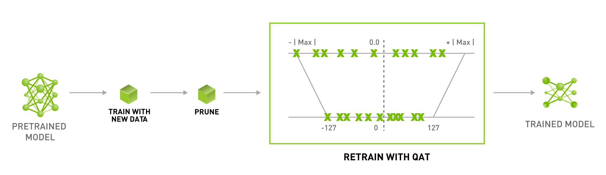
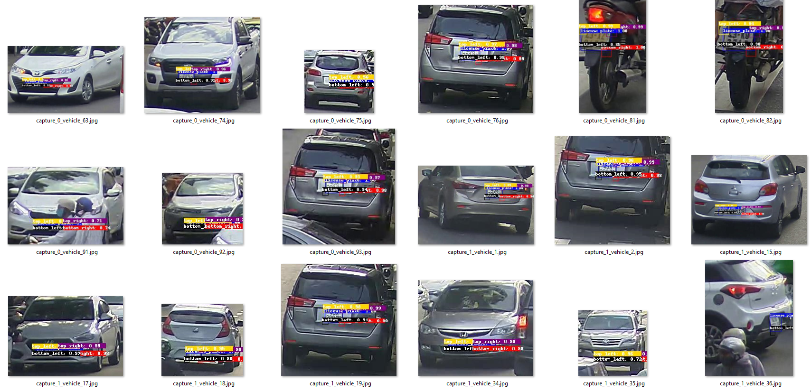

# TLT with Yolov4

Phần này mình sẽ đề cập đến việc train-prune-quantization-export model Yolov4 trên TLT
<p align="center">
  
</p>

## 1. Dataset

Mình sẽ lấy ví dụ trên bài toán license-plate detection, dữ liệu ban đầu mình định training ở định dạng Darknet, ta cần convert sang định dạng KITTI
- Cấu trúc thư mục

```
|--dataset
    |--train
      |-- images
          |-- 000000.jpg
          |-- 000001.jpg
                .
                .
          |-- xxxxxx.jpg
      |-- labels
          |-- 000000.txt
          |-- 000001.txt
                .
                .
          |-- xxxxxx.txt
    |--valid
      |-- images
          |-- 100000.jpg
          |-- 100001.jpg
                .
                .
          |-- xxxxxx.jpg
      |-- labels
          |-- 100000.txt
          |-- 100001.txt
                .
                .
      |-- xxxxxx.txt
```
- Mỗi file label ```.txt``` sẽ có dạng như sau:
```
<class-name> <truncation> <occlusion> <alpha> <xmin-ymin-xmax-ymax> <3Dheight-3Dwidth-3Dlength> <locationX-locationY-locationZ> <rotation_y>
```

Ví dụ:
```
car 0.00 0 -1.58 587.01 173.33 614.12 200.12 1.65 1.67 3.64 -0.65 1.71 46.70 -1.59
cyclist 0.00 0 -2.46 665.45 160.00 717.93 217.99 1.72 0.47 1.65 2.45 1.35 22.10 -2.35
pedestrian 0.00 2 0.21 423.17 173.67 433.17 224.03 1.60 0.38 0.30 -5.87 1.63 23.11 -0.03
```

Tuy nhiên, đối với bài toán detection, ta chỉ cần ```<class-name>``` và ```<xmin-ymin-xmax-ymax>```, chẳng hạn như sau:
```
car 0.00 0 0.00 587.01 173.33 614.12 200.12 0.00 0.00 0.00 0.00 0.00 0.00 0.00
cyclist 0.00 0 0.00 665.45 160.00 717.93 217.99 0.00 0.00 0.00 0.00 0.00 0.00 0.00
pedestrian 0.00 0 0.00 423.17 173.67 433.17 224.03 0.00 0.00 0.00 0.00 0.00 0.00 0.00
```

## 2. Training

### 2.1 Calculate anchor boxes (Optionals)
Ta có thể tính toán lại anchor để khớp với dữ liệu hiện tại hơn so với việc sử dụng anchors mặc định. Ở đây mình sử dụng 9 anchors (mặc định) với input đầu vào là **320x320**
```
docker run -it --gpus device=0 \
              -v <path-to-dataset-dir>:/yolov4 \
              nvcr.io/nvidia/tao/tao-toolkit-tf:v3.21.11-tf1.15.4-py3 \
              yolo_v4 kmeans -l /yolov4/dataset/train/labels -i /yolov4/dataset/train/images -x 320 -y 320 -n 9
```
```
Using TensorFlow backend.
Start optimization iteration: 1
Start optimization iteration: 11
Start optimization iteration: 21
Please use following anchor sizes in YOLO config:
(21.07, 8.14)
(16.10, 17.86)
(32.00, 11.17)
(45.33, 13.79)
(58.13, 15.17)
(35.48, 27.19)
(100.44, 22.34)
(157.33, 28.14)
(112.64, 53.33)
```

### 2.2 Setup Training

- Download pretrained object detection tại: https://catalog.ngc.nvidia.com/orgs/nvidia/teams/tao/models/pretrained_object_detection/files?version=resnet18
- Tạo file ```config.txt``` như sau (có thể thay các anchors ở **bước 2.1**):
```
random_seed: 42
yolov4_config {
  big_anchor_shape: "[(100.44, 22.34), (157.33, 28.14), (112.64, 53.33)]"
  mid_anchor_shape: "[(45.33, 13.79), (58.13, 15.17), (35.48, 27.19)]"
  small_anchor_shape: "[(21.07, 8.14), (16.10, 17.86), (32.00, 11.17)]"
  box_matching_iou: 0.25
  matching_neutral_box_iou: 0.5
  arch: "resnet"
  nlayers: 18
  arch_conv_blocks: 2
  loss_loc_weight: 5.0
  loss_neg_obj_weights: 50.0
  loss_class_weights: 1.0
  label_smoothing: 0.0
  big_grid_xy_extend: 0.05
  mid_grid_xy_extend: 0.1
  small_grid_xy_extend: 0.2
  freeze_bn: false
  freeze_blocks: 0
  force_relu: false
}
training_config {
  batch_size_per_gpu: 8
  num_epochs: 80
  enable_qat: false
  checkpoint_interval: 10
  n_workers: 16
  learning_rate {
    soft_start_cosine_annealing_schedule {
      min_learning_rate: 1e-7
      max_learning_rate: 1e-4
      soft_start: 0.3
    }
  }
  regularizer {
    type: L1
    weight: 3e-5
  }
  optimizer {
    adam {
      epsilon: 1e-7
      beta1: 0.9
      beta2: 0.999
      amsgrad: false
    }
  }
  pretrain_model_path: "/yolov4/pretrained/resnet_18.hdf5"
}
eval_config {
  average_precision_mode: SAMPLE
  batch_size: 8
  matching_iou_threshold: 0.5
}
nms_config {
  confidence_threshold: 0.001
  clustering_iou_threshold: 0.5
  top_k: 200
}
augmentation_config {
  hue: 0.1
  saturation: 1.5
  exposure:1.5
  vertical_flip:0
  horizontal_flip: 0.5
  jitter: 0.3
  output_width: 320
  output_height: 320
  output_channel: 3
  randomize_input_shape_period: 100
  mosaic_prob: 0.5
  mosaic_min_ratio:0.2
  image_mean {
    key: 'b'
    value: 103.9
  }
  image_mean {
    key: 'g'
    value: 116.8
  }
  image_mean {
    key: 'r'
    value: 123.7
  }
}
dataset_config {
  data_sources: {
      label_directory_path: "/yolov4/dataset/train/labels"
      image_directory_path: "/yolov4/dataset/train/images"
  }
  include_difficult_in_training: false
  target_class_mapping {
      key: "0"
      value: "top_left"
  }
  target_class_mapping {
      key: "1"
      value: "top_right"
  }
  target_class_mapping {
      key: "2"
      value: "bottom_right"
  }
  target_class_mapping {
      key: "3"
      value: "bottom_left"
  }
  target_class_mapping {
      key: "license_plate"
      value: "license_plate"
  }
  validation_data_sources: {
      label_directory_path: "/yolov4/dataset/valid/labels"
      image_directory_path: "/yolov4/dataset/valid/images"
  }
}
```
- Ta có cấu trúc thư mục **experiment-directory** như sau
```
|--experiment_directory
    |--dataset
        |--train
          |-- images
          |-- labels
        |--valid
          |-- images
          |-- labels
    |--pretrained
        |--resnet_18.hdf5
    |--config.pbtxt
    |--result                   # Empty directory, for saving training experiments  
```

#### 2.3 Training

Tiến hành training model, ước tính tốc độ khoảng 10p/epoch
```
docker run -it \
    --gpus device=GPU-82864c44-d125-bf84-645f-e800925bf730 \
    -v <path-to-exp-dir>:/yolov4 \
    nvcr.io/nvidia/tao/tao-toolkit-tf:v3.21.11-tf1.15.4-py3 \
    yolo_v4 train -r /yolov4/result -e /yolov4/config.txt -k license-plate-yolov4
```
trong đó
- ```-e```: đường dẫn đến file config
- ```-r```: đường dẫn đến thư mục rỗng ta vừa tạo ở trên, để lưu kết quả
- ```-k```: encryption key (dùng để bảo mật)
```
Epoch 1/80
1794/1794 [==============================] - 583s 325ms/step - loss: 5318.8814
Epoch 2/80
1794/1794 [==============================] - 606s 338ms/step - loss: 1908.2650
Epoch 3/80
1794/1794 [==============================] - 574s 320ms/step - loss: 1205.8788
Epoch 4/80
1794/1794 [==============================] - 605s 337ms/step - loss: 781.5306
Epoch 5/80                                                       
1794/1794 [==============================] - 612s 341ms/step - loss: 461.79600
Epoch 6/80
1794/1794 [==============================] - 577s 322ms/step - loss: 238.50448
Epoch 7/80
1794/1794 [==============================] - 539s 300ms/step - loss: 150.7208
Epoch 8/80
1794/1794 [==============================] - 452s 252ms/step - loss: 118.1437
Epoch 9/80
1794/1794 [==============================] - 528s 294ms/step - loss: 87.1544
Epoch 10/80
1794/1794 [==============================] - 507s 283ms/step - loss: 84.2129
Producing predictions: 100%|██████████████████████████████████████████████████████████████████████████████| 200/200 [00:56<00:00,  3.54it/s]
Start to calculate AP for each class
*******************************
bottom_left   AP    0.69871
bottom_right  AP    0.66928
license_plate AP    0.88446
top_left      AP    0.83912
top_right     AP    0.73392
              mAP   0.7651
*******************************
Validation loss: 41.868257820344645

Epoch 00010: saving model to /yolov4/result/weights/yolov4_resnet18_epoch_010.tlt
Epoch 11/80
1794/1794 [==============================] - 536s 299ms/step - loss: 72.5940
Epoch 12/80
1794/1794 [==============================] - 411s 229ms/step - loss: 72.2605
Epoch 13/80
1794/1794 [==============================] - 474s 264ms/step - loss: 70.1678
Epoch 14/80
1794/1794 [==============================] - 440s 245ms/step - loss: 62.9967
Epoch 15/80
1794/1794 [==============================] - 477s 266ms/step - loss: 60.0883
Epoch 16/80
1794/1794 [==============================] - 442s 246ms/step - loss: 67.2119
Epoch 17/80
1794/1794 [==============================] - 429s 239ms/step - loss: 60.7828
Epoch 18/80
1794/1794 [==============================] - 423s 236ms/step - loss: 63.6973
Epoch 19/80
1794/1794 [==============================] - 438s 244ms/step - loss: 59.6975
Epoch 20/80
1794/1794 [==============================] - 443s 247ms/step - loss: 58.8847
Producing predictions: 100%|██████████████████████████████████████████████████████████████████████████████| 200/200 [00:19<00:00, 10.39it/s]
Start to calculate AP for each class
*******************************
bottom_left   AP    0.89383
bottom_right  AP    0.89461
license_plate AP    0.90282
top_left      AP    0.90184
top_right     AP    0.90236
              mAP   0.89909
*******************************
Validation loss: 27.03866335112473

Epoch 00020: saving model to /yolov4/result/weights/yolov4_resnet18_epoch_020.tlt
Epoch 21/80
1794/1794 [==============================] - 439s 245ms/step - loss: 59.3640
Epoch 22/80
1794/1794 [==============================] - 416s 232ms/step - loss: 56.7960
Epoch 23/80
1794/1794 [==============================] - 429s 239ms/step - loss: 50.8113
Epoch 24/80
1794/1794 [==============================] - 413s 230ms/step - loss: 53.4037
Epoch 25/80
1794/1794 [==============================] - 419s 233ms/step - loss: 55.0338
Epoch 26/80
1794/1794 [==============================] - 409s 228ms/step - loss: 50.0400
Epoch 27/80
1794/1794 [==============================] - 423s 236ms/step - loss: 51.8978
Epoch 28/80
1794/1794 [==============================] - 424s 237ms/step - loss: 46.6411
Epoch 29/80
1794/1794 [==============================] - 433s 241ms/step - loss: 47.7704
Epoch 30/80
1794/1794 [==============================] - 425s 237ms/step - loss: 53.4221
Producing predictions: 100%|██████████████████████████████████████████████████████████████████████████████| 200/200 [00:18<00:00, 10.68it/s]
Start to calculate AP for each class
*******************************
bottom_left   AP    0.90769
bottom_right  AP    0.90685
license_plate AP    0.90797
top_left      AP    0.90704
top_right     AP    0.90646
              mAP   0.9072
*******************************
Validation loss: 19.06179749778819

Epoch 00030: saving model to /yolov4/result/weights/yolov4_resnet18_epoch_030.tlt
.
.
.
*******************************
bottom_left   AP    0.90807
bottom_right  AP    0.90862
license_plate AP    0.90787
top_left      AP    0.90773
top_right     AP    0.90664
              mAP   0.90779
*******************************
Validation loss: 13.344748003729459

Epoch 00080: saving model to /yolov4/result/weights/yolov4_resnet18_epoch_080.tlt
```
Kết thúc quá trình training, ta có thể xem tham số mAP từ file ```csv``` trong thư mục result

## 3. Evaluate
Tiến hành evaluate model, ở đây mình chọn model epoch 80
```
docker run -it \
        --gpus device=GPU-82864c44-d125-bf84-645f-e800925bf730 \
        -v <path-to-exp-dir>:/yolov4 \
        nvcr.io/nvidia/tao/tao-toolkit-tf:v3.21.11-tf1.15.4-py3 \
        yolo_v4 evaluate -m /yolov4/result/weights/yolov4_resnet18_epoch_080.tlt -e /yolov4/config.txt -k license-plate-yolov4
```
```
Start to calculate AP for each class
*******************************
bottom_left   AP    0.90807
bottom_right  AP    0.90862
license_plate AP    0.90787
top_left      AP    0.90773
top_right     AP    0.90664
              mAP   0.90779
*******************************
```
## 4. Prune
Tiến hành prune model loại bỏ các tham số thừa để tối ưu tốc độ
```
docker run -it \
        --gpus device=GPU-82864c44-d125-bf84-645f-e800925bf730 \
        -v /home/damnguyen/Deploy/transfer-learning-toolkit/license-plate-yolov4:/yolov4 \
        nvcr.io/nvidia/tao/tao-toolkit-tf:v3.21.11-tf1.15.4-py3 \
        yolo_v4 prune \
            -m /yolov4/result/weights/yolov4_resnet18_epoch_080.tlt \
            -o /yolov4/result/yolov4_resnet18_epoch_080_pruned.tlt \
            -k license-plate-yolov4 \
            -eq union \
            -pth 0.7 \
            -e /yolov4/config.txt

2022-01-18 02:35:26,737 [INFO] modulus.pruning.pruning: Exploring graph for retainable indices
2022-01-18 02:35:39,242 [INFO] modulus.pruning.pruning: Pruning model and appending pruned nodes to new graph
2022-01-18 02:39:38,593 [INFO] __main__: Pruning ratio (pruned model / original model): 0.26947645427472383
```
Model pruned của mình có kích thước 22.256.768, nhỏ hơn 10 lần so với model gốc 243.042.320, còn số lượng tham số bằng **0.269** tham số model gốc, tuy nhiên tiến hành evaluate độ chính xác bị giảm rất nhiều (chỉ số ```pth (threshold)``` càng lớn thì pruned model càng nhỏ, độ chính xác giảm càng nhiều)
```
pth = 0.7
*******************************
bottom_left   AP    0.52821
bottom_right  AP    0.52314
license_plate AP    0.17404
top_left      AP    0.53707
top_right     AP    0.50506
              mAP   0.4535
*******************************

pth = 0.5
*******************************
bottom_left   AP    0.90823
bottom_right  AP    0.9081
license_plate AP    0.90761
top_left      AP    0.9081
top_right     AP    0.90669
              mAP   0.90775
*******************************

pth = 0.3
*******************************
bottom_left   AP    0.90746
bottom_right  AP    0.90858
license_plate AP    0.90766
top_left      AP    0.90794
top_right     AP    0.90693
              mAP   0.90772
*******************************

pth = 0.1
*******************************
bottom_left   AP    0.90807
bottom_right  AP    0.90862
license_plate AP    0.90787
top_left      AP    0.90774
top_right     AP    0.90664
              mAP   0.90779
*******************************
```
## 5. Re-train pruned model
Để khôi phục lại độ chính xác sau khi prune, làm tương tự như training model, ta tiến hành re-train với một số điều chỉnh như sau
- ```pruned_model_path```: đường dẫn tới pruned model ở bước 4
- Thêm ```enable_qat=true``` vào ```training_config```
- ```type``` của ```regularizer``` nên để là ```NO_REG``` để pruned model hội tụ tốt hơn về phía model gốc
```
*******************************
bottom_left   AP    0.9083
bottom_right  AP    0.90858
license_plate AP    0.90859
top_left      AP    0.90869
top_right     AP    0.90748
              mAP   0.90833
*******************************
Validation loss: 50.97076883824268
```
## 6. Inference
Mình có tập ảnh không nhãn trong thư mục ```test``` bên cạnh thư mục ```train``` và ```valid```, mình sẽ tiến hành lấy pseudo-label cho tập test như sau:
```
docker run -it \
    --gpus device=GPU-82864c44-d125-bf84-645f-e800925bf730 \
    -v <path-to-exp-dir>:/yolov4 \
    nvcr.io/nvidia/tao/tao-toolkit-tf:v3.21.11-tf1.15.4-py3 \
    yolo_v4 inference -i /yolov4/dataset/test \
                      -o /yolov4/dataset/test_vis \
                      -e /yolov4/config-pruned.txt \
                      -m /yolov4/result-retrain/weights/yolov4_resnet18_epoch_010.tlt \
                      -k license-plate-yolov4 \
                      -l /yolov4/dataset/test_annotated
```
Thư mục ```test_vis``` sẽ chứa ảnh visualize và thư mục ```test_annotated``` sẽ chứa pseudo-label mà mô hình dự đoán, ta có thể sử dụng để fineturning lại model
<p align="center">
  
</p>

## 7. Export model (để sử dụng trong triton hoặc deepstream)
- FP16/FP32
```
docker run -it \
    --gpus device=GPU-82864c44-d125-bf84-645f-e800925bf730 \
    -v <path-to-exp-dir>:/yolov4 \
    nvcr.io/nvidia/tao/tao-toolkit-tf:v3.21.11-tf1.15.4-py3 \
    yolo_v4 export -m result-retrain/weights/yolov4_resnet18_epoch_010.tlt \
                  -k license-plate-yolov4 \
                  -o yolov4_resnet18_epoch_010-fp32.etlt \
                  -e config-retrain.txt \
                  --data_type fp32 \
```

- INT8 (calibrate with 256*8 images from training set)
```
docker run -it \
    --gpus device=GPU-82864c44-d125-bf84-645f-e800925bf730 \
    -v <path-to-exp-dir>:/yolov4 \
    nvcr.io/nvidia/tao/tao-toolkit-tf:v3.21.11-tf1.15.4-py3 \
    yolo_v4 export -m result-retrain/weights/yolov4_resnet18_epoch_010.tlt \
                  -k license-plate-yolov4 \
                  -o yolov4_resnet18_epoch_010-int8.etlt \
                  -e config-retrain.txt \
                  --data_type int8 \
                  --cal_data_file calib.tensor \
                  --cal_image_dir dataset/train/images \
                  --cal_cache_file calib.bin \
                  --batches 256 \
                  --batch_size 8
```

Reference
- TAO Toolkit - Yolov4: https://docs.nvidia.com/tao/tao-toolkit/text/object_detection/yolo_v4.html
