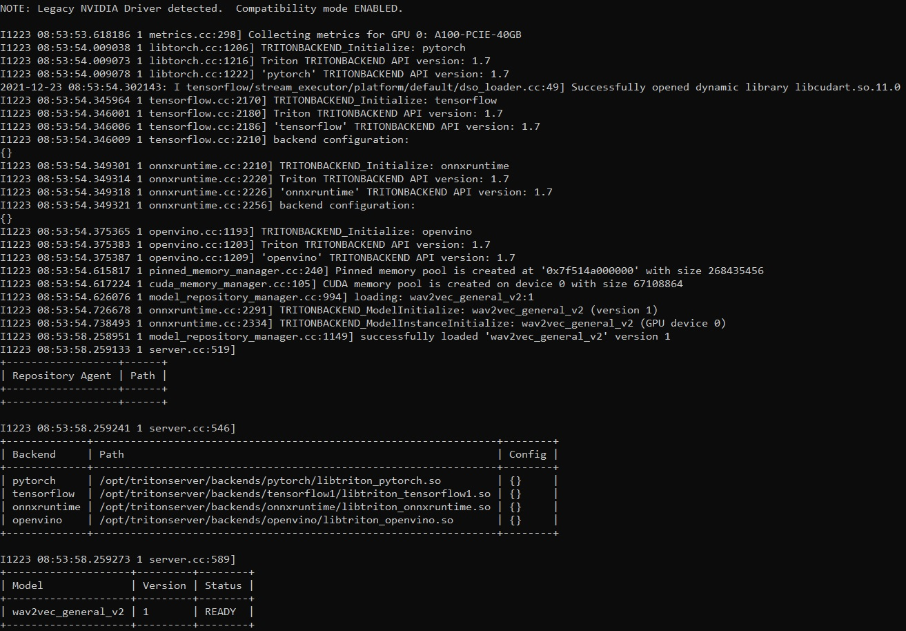

# Install Triton

Nội dung phần này sẽ đề cập đến việc cài đặt và sử dụng nhanh triton-server và triton-client.

## 1. Cài đặt triton-server
Nếu server đã cài đặt **triton-server** rồi thì có thể bỏ qua bước này và chuyển đến cài đặt và sử dụng **triton-client**. Hiện tại cách nhanh nhất để sử dụng triton-inference-server là docker từ NVIDIA NGC. Ngoài ra phương pháp build-from-source nếu có dịp mình sẽ trình bày sau. 
### 1.1 Cài đặt sử dụng NVIDIA NGC 
```
docker pull nvcr.io/nvidia/tritonserver:<xx.yy>-py3
```
trong đó ```<xx.yy>``` là phiên bản, chẳng hạn
```
docker pull nvcr.io/nvidia/tritonserver:21.12-py3
```
### 1.2 Chạy thử model
Ở đây mình sẽ chạy thử mô hình wav2vec-base (mà mình đã convert sang ONNX) sử dụng backend là ONNX-runtime. Cấu trúc thư mục mình xây dựng như sau:
```bash
├── models
│   ├── wav2vec_general_v2
│   │   ├── 1
│   │   │   ├── model.onnx
│   │   ├── config.pbtxt
```
File ```config.pbtxt```
```
name: "wav2vec_general_v2"
platform: "onnxruntime_onnx"
max_batch_size : 0
input [
  {
    name: "input"
    data_type: TYPE_FP32
    dims: [1, -1]
  }
]
output [
  {
    name: "output"
    data_type: TYPE_FP32
    dims: [-1, -1, 105]
  }
]
```
Chạy triton-server sử dụng GPU 1 <i>(Hiện tại mình đang ở thư mục cùng bậc với thư mục ```models```)</i>
```
docker run --gpus device=1 --rm -p8000:8000 -p8001:8001 -p 3 tritonserver --model-repository=/models
```
Hoặc chạy triton-server sử dụng GPU 1 và cơ chế ```share-memory```
```
docker run --gpus device=1 --rm --ipc=host --shm-size=128m -p8000:8000 -p8001:8001 -p 3 tritonserver --model-repository=/models
```

Output
<p align="left">
  
</p>


## 2. Cài đặt triton-client
### 2.1 Cài đặt cơ bản
Với mục đích cơ bản là gọi từ ```python```, ta có thể cài đặt nhanh sử dụng ```pip```
```
pip install tritonclient grpcio-tools
```
### 2.2 Cài đặt nâng cao
Khác việc sử dụng ```pip``` để cài đặt và sử ```python``` để gọi đến **triton-server**, ở đây chủ yếu đề cập đến việc ```build-from-source``` để sử dụng một số thư viện đi kèm như **Model Analyst** và **Performance Analyst**
- Cài đặt các thư viện Linux
```
sudo apt-get install curl libcurl4-openssl-dev libb64-dev default-jdk maven
```
- Cài đặt ```rapidjson```
```
git clone https://github.com/Tencent/rapidjson.git
cd rapidjson
cmake .
make
sudo make install
```
- Thêm 1 thư viện ```python``` không nó lại bắn lỗi giữa chừng lại mất công build lại 1 đoạn
```
python3 -m pip install grpcio-tools
```
- Tiến hành build **triton-client** (ở đây **triton-server** mình sử dụng Docker phiên bản r21.12)
```
git clone --recursive https://github.com/triton-inference-server/client.git triton-client
cd triton-client
mkdir build && cd build
cmake -DCMAKE_INSTALL_PREFIX=`pwd`/install -DTRITON_ENABLE_CC_HTTP=ON -DTRITON_ENABLE_CC_GRPC=ON -DTRITON_ENABLE_PERF_ANALYZER=ON -DTRITON_ENABLE_PYTHON_HTTP=ON -DTRITON_ENABLE_PYTHON_GRPC=ON -DTRITON_ENABLE_JAVA_HTTP=ON -DTRITON_ENABLE_GPU=ON -DTRITON_ENABLE_EXAMPLES=ON -DTRITON_ENABLE_TESTS=ON -DTRITON_COMMON_REPO_TAG=r21.12 -DTRITON_THIRD_PARTY_REPO_TAG=r21.12 -DTRITON_CORE_REPO_TAG=r21.12 -DTRITON_BACKEND_REPO_TAG=r21.12 ..
make cc-clients python-clients java-clients
```
- Sau đó những thư viện ta đã build sẽ xuất hiện trong thư mục ```triton-client/build/install``` và cái chúng ta cần quan tâm sẽ là ```bin/perf_analyzer```
### 2.3 Sử dụng triton-client để gọi và lấy kết quả
Tham khảo [src/sample_grpc.py](../src/sample_grpc.py)

