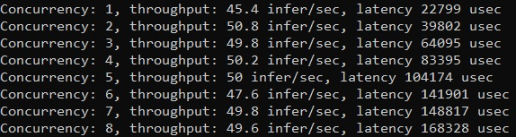
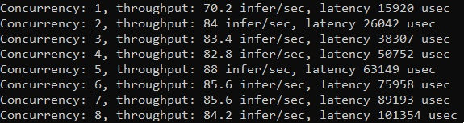

# Performance Analyst Tool 
**Performance Analyst** là tool dùng để phân tích tốc độ từ phía người dùng. Để sử dụng, ta phải cài đặt **triton-client** từ source như trong hướng dẫn sau:
- [Cài đặt Triton-inference-server](install.md#2-2-cài-đặt-nâng-cao)

Một số thuật ngữ mà ta cần chú ý:
- **Throughput**: tốc độ xử lý requests (thường là số lượng requests/s)
- **Latency**: thời gian chờ để xử lý xong một requests

Ví dụ: Throughput hiện tại trên 1 concurency đạt được là 50 requests/s với latency 100ms, khi tăng số lượng concurrencies lên 2 thì throughput vẫn như vậy nhưng latency tăng lên 200ms

Ta sẽ lấy ví dụ cho việc phân tích model ```wav2vec_general_v2``` mình đang deploy như sau:
```
perf_analyzer -m wav2vec_general_v2 --percentile=95 --concurrency-range 1:8 --shape input:1,320000
```
Kết quả trả về cho chúng ta **throughput** và **latency** với backend **ONNX-runtime**
<p align="left">
  
</p>

Ta sẽ tiến hành thay đổi cấu hình ```config.pbtxt``` để sử dụng optimized **ONNX-TensorRT**, khởi động lại Triton-inference-server và so sánh kết quả. Lưu ý rằng quá trình load lại mô hình sẽ lâu hơn vì phải mỗi lần khởi động lại triton sẽ convert mô hình từ **ONNX** sang **TensorRT**
```
optimization { execution_accelerators {
  gpu_execution_accelerator : [ {
    name : "tensorrt"
    parameters { key: "precision_mode" value: "FP32" }
    parameters { key: "max_workspace_size_bytes" value: "1073741824" }
    }]
}}
```

Lưu ý giá trị <b>1073741824 = 1 x 1024 x 1024 x 1024 (bytes) = 1Gb</b> là giá trị ```workspace``` mặc định, đối với model **kích thước lớn** ta cần đẩy giá trị này lên cao, chẳng hạn **4Gb = 4294967296**

Kết quả
<p align="left">
  
</p>

Như vậy, đối với mô hình trên, việc sử dụng backend TensorRT (FP32) giúp cải thiện tốc độ đáng kể (**1.76** lần) so với sử dụng backend ONNX-runtime thông thường.
*(Bạn có thể thử với FP16, nó sẽ không chỉ dừng ở con số **1.76** kia đâu)*